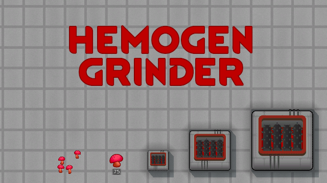

# Hemogen Grinder

Adds 3 variants of grinders that can process [Hemofungus](https://steamcommunity.com/sharedfiles/filedetails/?id=2882143237) into hemogen and push it to [VRE-S](https://steamcommunity.com/sharedfiles/filedetails/?id=2963116383) hemogen network.

Amount of hemogen produced is tied to nutrition value of source product, and smaller grinders are less efficient.

TODO: add more source varieties. Pls write in comments what you'd like to see there.

[VNPE Fridge Fix](https://steamcommunity.com/sharedfiles/filedetails/?id=2976541719) built-in.

## Verified compatible/supported mods

- [Hemofungus](https://steamcommunity.com/sharedfiles/filedetails/?id=2882143237)
- [Vanilla Races Expanded - Sanguophage](https://steamcommunity.com/sharedfiles/filedetails/?id=2963116383)
- [Vanilla Nutrient Paste Expanded](https://steamcommunity.com/sharedfiles/filedetails/?id=2920385763)

## You may also like...

https://github.com/zed-0xff/RW-HemogenGrinder

## Support me

 or [Patreon](https://www.patreon.com/zed_0xff)
